# SPUR

Metric-depth inference and 3D reconstruction for robotic pruning experiments.

One bark, one camera sweep, dormant Envy/UFO, Blender. This model has never seen a real orchard. Training lives in [the depth research repository](https://github.com/joses2017smjh/Vision-Based-Metric-Depth-Estimation-for-Robotic-Pruning).

<p align="center">
  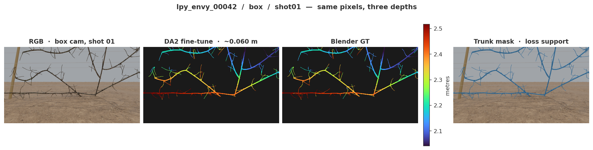
</p>

---

## Engineering overview

- **Problem:** turn predicted depth into a callable, testable service with explicit units and model identity.
- **Contribution:** FastAPI endpoints, checkpoint contracts, multi-view preprocessing, split ONNX export, and reconstruction from calibrated cameras.
- **Evidence:** the published synthetic three-pair refiner reports 0.0445 ± 0.0057 m RMSE. Hardware-specific inference timings and parity checks are below.
- **Limit:** synthetic data only. A successful API response in dummy mode does not run the trained model or establish field accuracy.

[Visual case study](https://jose-sanchez-portfolio-com.vercel.app/projects/depth-estimation-robotic-pruning/) · [API contract tests](tests/test_api.py) · [Training experiments](https://github.com/joses2017smjh/Vision-Based-Metric-Depth-Estimation-for-Robotic-Pruning)

## Single-view and multi-view inference

<p align="center">
  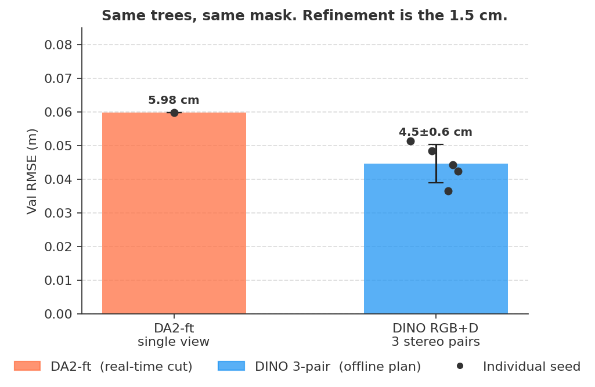
  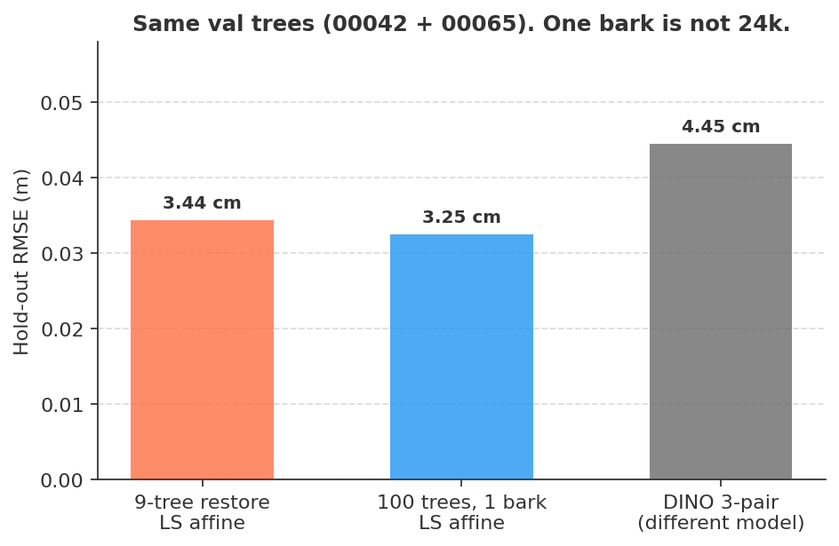
</p>

| | Real-time | Offline |
| --- | --- | --- |
| Call | `POST /predict` | `POST /predict/group` |
| Input | 1 RGB | 6 views, same shot, 3 rigs |
| Stack | DA2-ft | DA2-ft, then DINOv2 RGB+D |
| Trunk RMSE | ~0.060 m | **0.0445 ± 0.0057 m** |

<p align="center">
  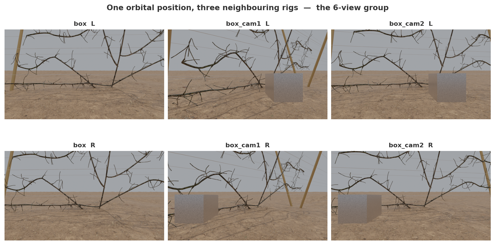
</p>

<p align="center">
  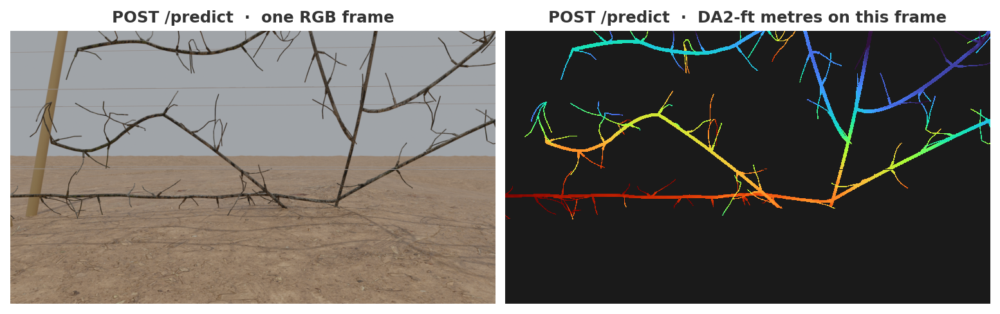
</p>

---

## What the stack actually does

SSD made single-shot boxes the default. Orchard papers moved to YOLO.
RAFT is still the flow a 2025 pruning policy trusts more than a depth camera.
DA2-ft plus a frozen ViT-L is the metric step. Reconstruction is back-projection
of those metres with the cameras we already logged. Sensors add; they do not vote.
A 30 cm box is the only sim-to-real check that comes back in metres.

Code: `spur_depth/pipeline/`. Notes: [`docs/RESEARCH.md`](docs/RESEARCH.md).

<p align="center">
  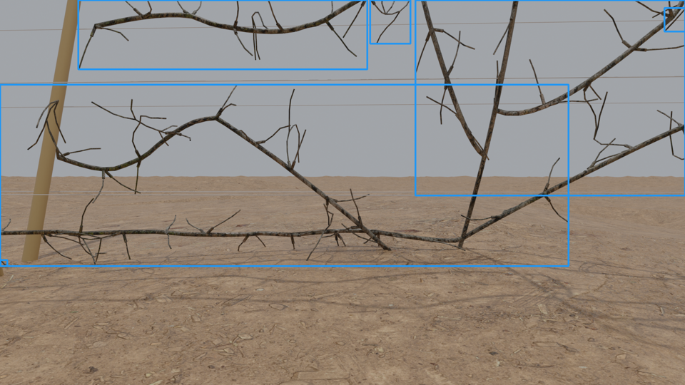
  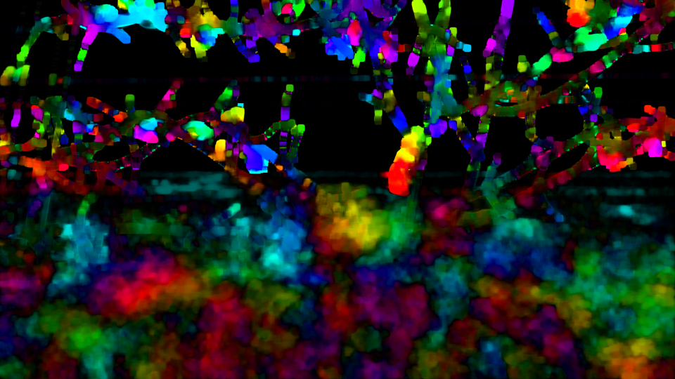
</p>

<p align="center">
  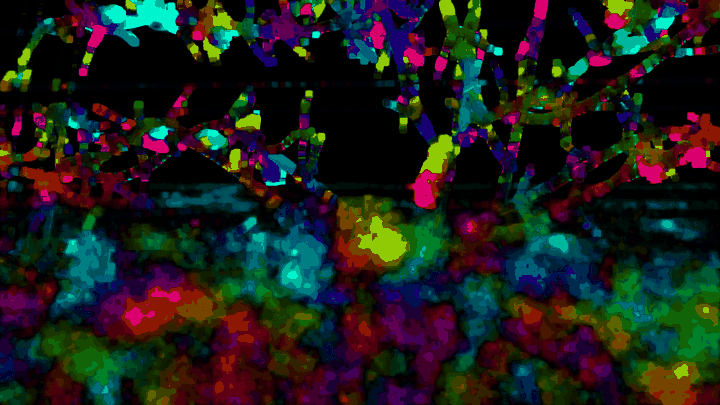
</p>

<p align="center">
  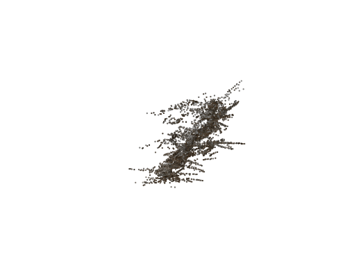
</p>

Same tree, four cameras, DA2-ft metres, Blender `K` and `T_wc`. No second network.

---

## Run the CPU API smoke test

Python 3.10 or newer. The following uses a **dummy runner** with no weights or GPU.
It checks the HTTP contract, not depth-model accuracy.

```bash
git clone https://github.com/joses2017smjh/spur-depth-service.git
cd spur-depth-service
export SPUR_SKIP_WEIGHTS=1
pip install -e ".[serve,dev]"
python -m spur_depth.serve
# In another terminal:
curl http://localhost:8000/readyz  # backend: dummy
curl -F "image=@samples/view_01.png" localhost:8000/predict
```

```bash
docker build -t spur-depth:cpu .
docker run --rm -p 8000:8000 -e SPUR_SKIP_WEIGHTS=1 spur-depth:cpu
```

Run `python -m pytest tests/test_api.py -q` to check requests, validation errors, readiness, and queue limits with the dummy backend.

Real weights: mount `best_epoch_0023.pt` (SHA in `weights.lock`), set `SPUR_CKPT`.
`/predict` needs `SPUR_DA2_CKPT` or it is 501. Wrong view count is 422. Queue full is 503. One GPU, one worker.

---

## Numbers, named by GPU

<p align="center">
  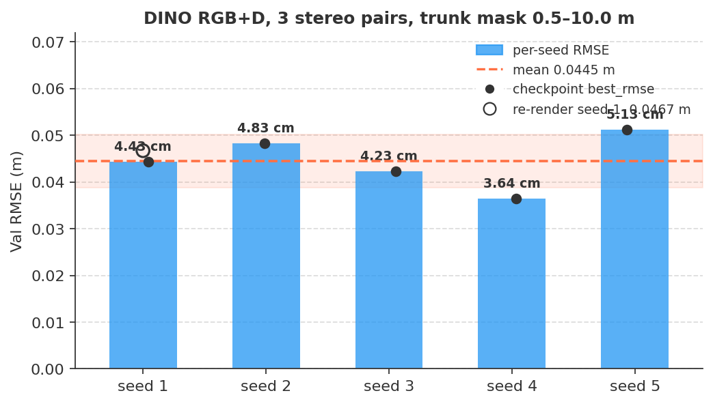
  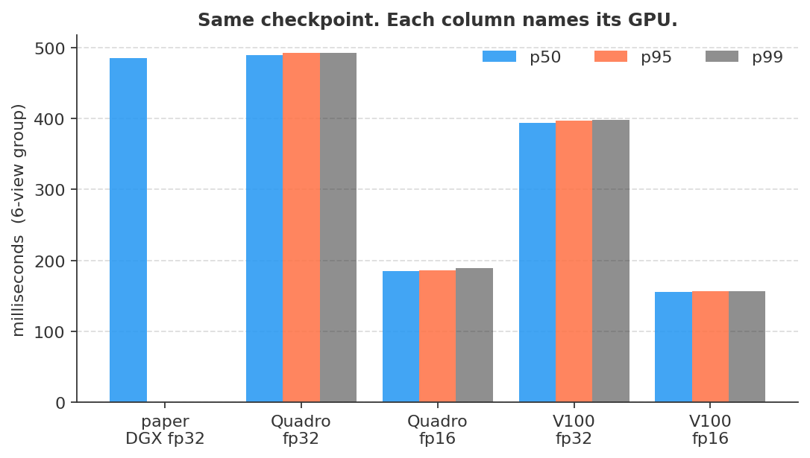
</p>

Re-scored seed-1 on the 2026-08-20 re-render: **0.0467 m** (paper 0.0445 ± 0.0057).

| GPU | precision | p50 | p95 | p99 |
| --- | --- | --- | --- | --- |
| Quadro RTX 8000 | fp32 | 489.2 | 492.0 | 492.6 |
| Quadro RTX 8000 | fp16 | 185.5 | 185.6 | 189.7 |
| Tesla V100-SXM3-32GB | fp32 | **393.5** | 397.2 | 397.8 |
| Tesla V100-SXM3-32GB | fp16 | **156.0** | 156.2 | 156.3 |

TensorRT fuse/decode exists (`engines/fuse_decode_fp16_quadro-rtx-8000.plan`, 58 MB, **FP32**, RTX 8000). Fuse-only p50 327 ms. That is not end-to-end refiner latency. There is no encoder/DA2 `.plan`.

ONNX is split (`encoder.onnx` 1.2 GB, `fuse_decode.onnx` 26 MB) so six views do not unroll 144 ViT-L blocks. Torch vs ORT max abs 1.53e-5 / 9.5e-7.

<p align="center">
  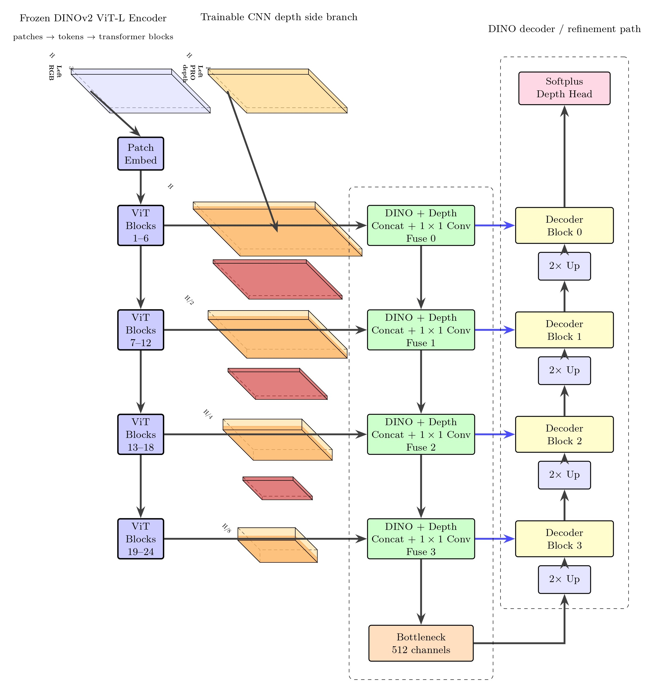
</p>

<p align="center">
  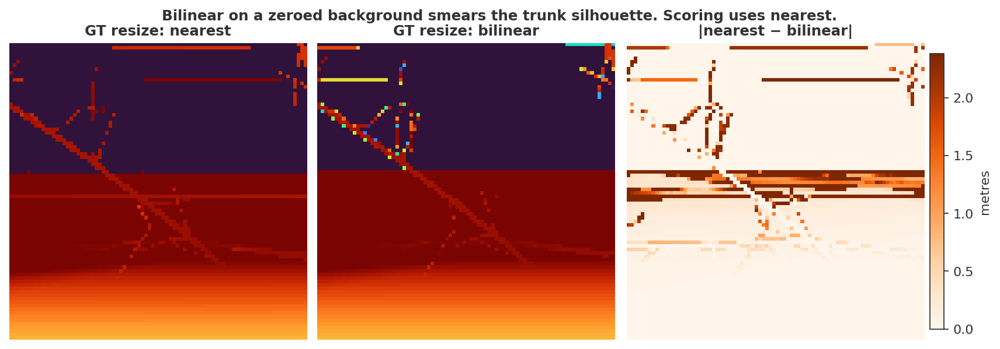
</p>

Bilinear on a zeroed background smears the silhouette. Scoring uses nearest. Input depth stays bilinear — that is the 0.0445 m run.

---

## Honest

- Synthetic only. `pipeline.sim2real` reports appearance stats and the 30 cm box scale. It does not invent a field RMSE.
- 100 trees, one bark (`bark_brown_02`), 6000 DA2 frames are on disk
  (job `21036824`). That is not the paper 4-bark 24k set.
- DA2 hold-out affine, fit on 98 trees, score `00042`+`00065`: **0.0325 m**
  on the GT trunk mask (n=78). JSON: `bench/results/orchard_bark02_affine.json`.
  The older 9-tree number was 0.0344 m. Do not call this 24k.
- Drift fixture is still the 6-view baseline, not 6000 frames.
- TinyUNet on 100 trees: val IoU **0.930**. DA2 on predicted masks is still **0.112 m** vs **0.031 m** on GT. YOLO-nano val F1@0.5 is 0.035. Box-gated field RMSE is ~2 m. Not a field detector.
- Long shipping notes: [`docs/README.draft.md`](docs/README.draft.md). Checklist: [`SHIPPING.md`](SHIPPING.md).

---

## Report: trees, textures, cylinders, what we can generate

Generator: `Computer_Vision/Dataloader/generate_tree2.py`  
`blender -b orchard_template.blend -P Dataloader/generate_tree2.py`

This model has never seen a real orchard. Geometry on the cut is **cylinders**, not the raw PLY. Each organ is a capsule: centroid, unit axis, radius, length, all in metres. Trees are tilted `TREE_TILT_DEG = (-17.143, 0, 0)` so the trunk sits parallel to the orchard posts.

### Tree models

200 L-Py dormant apple trees. Matching PLY + metadata for every ID.

| Architecture | IDs | Assets | In the 6000-frame restore |
| --- | --- | --- | --- |
| Envy (`lpy_envy_*`) | `00000`–`00099` | 100 PLY + 100 JSON | **yes** |
| UFO (`lpy_ufo_*`) | `00000`–`00099` | 100 PLY + 100 JSON | no |

`TREE_ID_FILTER = "envy"` is the default. UFO meshes are on disk; job `21036824` did not render them.

`trees/metadata/{id}_metadata.json`:

| Field | What it is |
| --- | --- |
| `seed_value` | L-Py seed (`lpy_envy_00000` = 700116) |
| `hierarchy` | Parent → children: `trunk_*`, `branch_*`, `spur_*`, `nontrunk_*` |
| `cylinder_data` | Map of full cylinder records. Example Envy tree: **1798** cylinders (80 trunk / 444 branch / 1034 spur / 240 nontrunk). Example UFO tree: **2960**. |
| `per_cylinder_label` | `true` |
| `axiom_pitch` / `axiom_yaw` | L-system axiom pose |
| `branch_locations`, `color_mapping` | Extra L-Py bookkeeping |

`RENDER_ONLY_PART = True` builds the mesh from those cylinders (`CV_RENDER_BRANCHES` / `CV_RENDER_SPURS`; set both to 0 for trunk-only).

### Cylinder records

**Local** (inside `cylinder_data`; keys are voxel-style ids like `"(0, 0, 0)"`):

```json
{
  "part_name": "trunk_1",
  "centroid": [0.0131, -0.0040, 0.0218],
  "orientation": [0.825, -0.194, -0.531],
  "radius": 0.0487,
  "length": 0.1942
}
```

**World sidecar** `cylinders_world/{bark}/{tree}.json`: same fields after Blender `matrix_world` (centroid + unit orientation in orchard metres).

**Per-frame `ann/*.json`**: `cylinders_world` is **centroids only** `[x, y, z]` (backward compatible). Full radius / length / part_name live in the sidecar, not in every frame file.

Each `ann` also has:

```
tree_id, shot, variant,
rgb_path, depth_path,
masks.tree_only,
camera.location, camera.rotation_euler,
camera.intrinsics.width / height / K (3×3),
reference.post0 / post1,
tree_object, background_objects
```

Reconstruction: `K` + `location` / `rotation_euler` → `T_wc`.

### Bark textures we can render

`BARK_TEXTURES` in `generate_tree2.py`. 4K PBR: `_diff_4k.jpg` + `_nor_gl_4k.exr` (Non-Color). Displacement and roughness sit on disk; the shader uses diffuse + normal. `bark_brown` files are prefixed `bark_brown_01_*`; the loader falls back to that glob.

| Folder | In `BARK_TEXTURES` | On this restore |
| --- | --- | --- |
| `bark_brown` | yes | no |
| `bark_brown_02` | yes | **yes** (6000 DA2 frames) |
| `bark_willow` | yes | no |
| `bark_willow_02` | yes | no |

Also on disk, **not** wired in the generator:

| Folder | Role |
| --- | --- |
| `bark_palm_tree`, `palm_tree_bark` | extra bark maps |
| `sakura_bark`, `japanese_hackberry` | extra bark maps |
| `brown_mud`, `dirt_floor`, `rock_ground` | ground, not tree bark |
| `tree_dataset/envy_labelled`, `tree_dataset/ufo_labelled` | older labelled meshes; **not** the L-Py 200 |

Those do not count as orchard barks until they are added to `BARK_TEXTURES`.

### What the generator can write (1920×1080)

```
Data/full_spur/
  rgb/{bark}/{tree}/{set}/              {tree}_shot{01-06}.png          (center)
  Optical_flow/{bark}/{tree}/{set}/     {tree}_shot{01-06}_{l|r}.png    (stereo RGB)
  depth/{bark}/{tree}/{set}/            metric GT .npy  (center + _l + _r)
  mask/{bark}/{tree}/{set}/             tree-only PNG
  box_mask/{bark}/{tree}/{set}/         30 cm camera-rect PNG (box_cam only)
  ann/{bark}/{tree}/{set}/              K, pose, centroid list
  cylinders_world/{bark}/{tree}.json    full world cylinders
  Da2Finetune/{bark}/{tree}/{set}/      Engine A depth .npy (second pass)
```

`{set}` is the camera rig. 6 Z-shots, X/Y fixed, Z from 0.85 m to 3.73 m. Stereo baseline 0.12 m on camera-right.

| Rig | Default | What it is |
| --- | --- | --- |
| `box` | 1 | Front Z-sweep. Camera-rect is **removed** in this pass. |
| `box_cam1`–`box_cam8` | 8 (`CV_NUM_BOX_CAM_POSES`) | Same 100° arc, **with** the 30 cm camera-rect (`CAMERA_RECT_DEPTH = 0.30`) |
| `cam1`–`cam10` | 10 | Same arc, no rect. `CV_SKIP_CAM=1` drops these. |
| `_l` / `_r` | 2 | Stereo pair |

Optional second pass: `infer_monocular_tree.py` (`CV_DEPTH_MODELS=da2ft`, DA3 if requested). Trunk-only: `CV_RENDER_BRANCHES=0 CV_RENDER_SPURS=0`.

The **24k** people quote is four barks of the *eval* camera set, not the default 19-rig sweep:

`4 barks × 100 Envy × 5 rigs (box + box_cam1–4) × 6 Z × 2 stereo = 24 000` DA2 / Optical_flow maps.

Default `generate_tree2.py` (cam1–10 + box_cam1–8 + box) is larger than that. Do not call either number “on disk” until the files exist.

### What is actually on HPC now

Job `21036824` (`orchard91`) + the 9-tree val restore. Envy only, `bark_brown_02`, `CV_SKIP_CAM=1`, `CV_NUM_BOX_CAM_POSES=4`. RGB and `cylinders_world` were **not** copy-backed on the 91-tree job (storage).

| Modality | Files | Note |
| --- | --- | --- |
| `depth` / `mask` / `ann` | 9000 | 100 trees × 5 rigs × 6 shots × (center + L + R) |
| `Optical_flow` / `Da2Finetune` | 6000 | L/R only |
| `box_mask` | 7200 | `box_cam1`–`box_cam4` only (no `box/` folder) |
| `rgb` | 279 | leftover from the 9 val trees |
| `cylinders_world` sidecars | 9 | same 9 val trees; every `ann` still has world centroids |

Paper val trees stay `lpy_envy_00042` and `lpy_envy_00065`. Fit is the other 98 Envy trees. Quote **0.0325 m**. This is one bark, 6000 DA2 frames. It is not 24k.

To grow it: same generator, set `BARK_NAME` / `TREE_ID`, write to Depot not stak. UFO needs `TREE_ID_FILTER` unset. The other three barks are a second array, not a CSV. Sidecar cylinders come back if `cylinders_world/` is in the copy list.

---

MIT. DINOv2 is Apache-2.0.

Jose Sanchez — sanchej7@oregonstate.edu — Oregon State University
