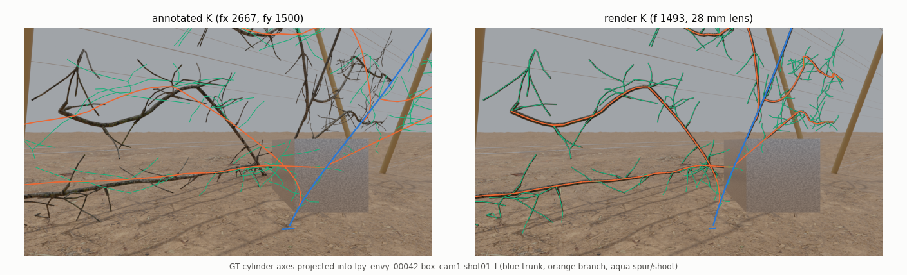
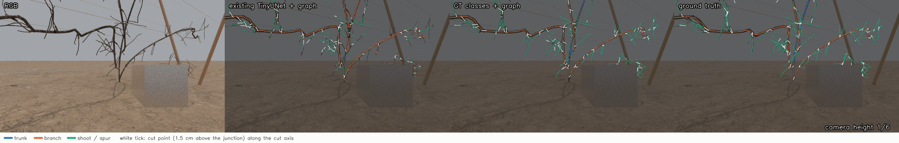
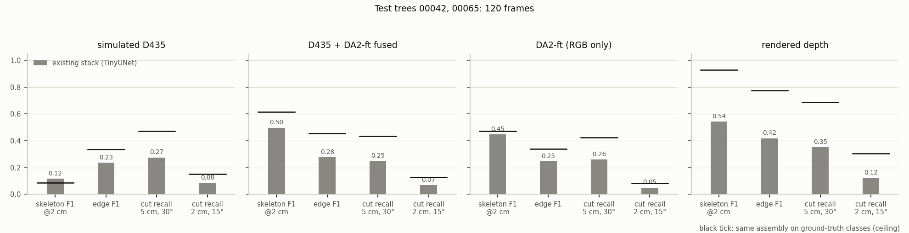
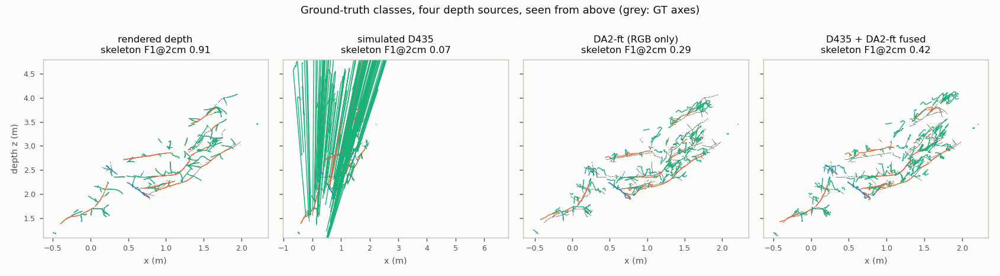
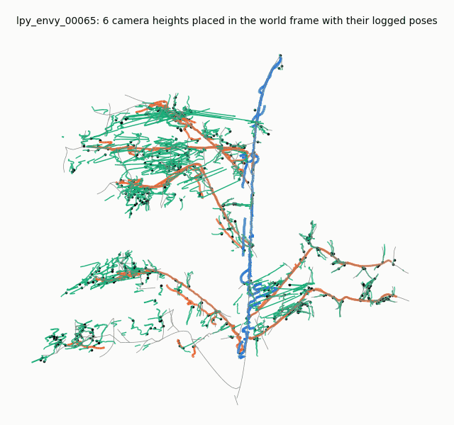

# SPUR — Metric Depth for Robotic Pruning

FastAPI inference, multi-view RGB-D refinement, calibrated point-cloud reconstruction, and branch perception (detect, 3D-localize, connect) for synthetic orchard experiments.

[](https://jose-sanchez-portfolio-com.vercel.app/projects/depth-estimation-robotic-pruning/)

[Case study](https://jose-sanchez-portfolio-com.vercel.app/projects/depth-estimation-robotic-pruning/) · [Research](https://github.com/joses2017smjh/Vision-Based-Metric-Depth-Estimation-for-Robotic-Pruning) · [API tests](tests/test_api.py) · [Detailed evidence](docs/RESEARCH.md)

## Problem and contribution

Thin branches require depth in metres, explicit camera geometry, and a traceable model identity. I built the serving layer, checkpoint contracts, multi-view preprocessing, split ONNX export, and reconstruction pipeline around the research models. The branch module turns one RGB-D frame into a tree graph with cut points and is scored against exact ground truth under a protocol fixed before testing.

## Results and scope

- **Accuracy:** five stored best-validation scores average **0.0445 ± 0.0057 m** trunk RMSE for DINOv2 RGB+D refinement over three stereo pairs. These are checkpoint validation records, not an independent test-set rescore. [Seed records](bench/results/seed_rmse.json).
- **Re-render check:** seed 1 scores **0.0467 m** over 60 six-view groups; changed renders make this a separate evaluation. [Artifact](bench/results/tesla-v100-sxm3-32gb_2026-08-22_eval.json).
- **Inference:** Tesla V100 fp16 refiner-only p50 **156 ms** for six 280×512 views, batch 1, 20 warmups and 200 timed calls. DA2 inference and HTTP overhead are excluded; the artifact retains earlier runs with larger tails. [Timing runs](bench/results/tesla-v100-sxm3-32gb_2026-08-22.json).
- **Export parity:** Torch versus ONNX Runtime maximum absolute differences of **1.53e-5** for the encoder and **9.54e-7** for fuse/decode. This checks numerical agreement, not accuracy. [Artifact](bench/results/onnx_parity_2026-08-22.json).
- **Branch perception:** on two held-out trees (120 frames), the new tree-graph assembly reaches skeleton F1 @2 cm **0.93** and Jain-criterion cut recall **0.69** with ground-truth classes and rendered depth; the existing 256-px detector cuts that recall to **0.35**. [Section](#branch-perception-detect-localize-connect) · [Evidence](bench/results/branches_test_2026-10-02.json)

All model accuracy above is synthetic. Real-orchard accuracy is unverified. Predicted-mask depth remains **0.112 m** versus **0.031 m** with ground-truth masks; detection and segmentation remain deployment constraints. [Research notes](docs/RESEARCH.md).

## Camera intrinsics correction

[](docs/readme/k_fix_report.json)

The `K` stored in every annotation, `[[2667, 0, 960], [0, 1500, 540]]`, is a hard-coded placeholder. The render camera is a 28 mm lens on a 36 mm sensor: f = 1493.3 px on both axes, principal point (959.5, 539.5); a free fit over 7 frames gives 1493.45 ± 0.10 px. With that `K`, ground-truth depth lies on the rendered branch cylinders with a **0.09 mm** median surface error instead of 7.2 cm, and the four-view DA2-ft reconstruction error falls from **7.0 cm to 7.4 mm**. Per-pixel depth RMSE does not use `K` and is unchanged. The six-view refiner was trained with the placeholder and has not been retrained. [Report](docs/readme/k_fix_report.json) · [Code](spur_depth/camera.py) · [Test](tests/test_camera.py)

## Branch perception: detect, localize, connect

[](docs/readme/branch_figures.json)

One RGB-D frame becomes a tree graph: every trunk, scaffold branch, shoot and spur as a metric 3D axis with radius, its parent and junction, and a **cut point with the cut axis**, which is what a cutter needs to close perpendicular to the wood (Jain, Grimm, Lee, ICRA 2025). Per-pixel classes are skeletonized and lifted with depth plus the radius, because the camera sees bark, not the axis. A depth-jump test keeps image crossings from becoming junctions, and every part's parent is chosen jointly by a minimum-cost arborescence with a botanical prior. `POST /branches` serves it, and `spur_depth.branches.export.cut_targets` writes Isaac-ready world-frame cut records.

- **Thin wood is the detector's job, not the graph's:** with rendered depth, the same assembly scores skeleton F1 @2 cm **0.93** on ground-truth classes vs **0.54** on the existing 256-px TinyUNet mask, and Jain-criterion cut recall **0.69** vs **0.35**.
- **RGB-D needs fusion on thin wood:** with ground-truth classes, simulated D435 depth gives skeleton F1 @2 cm **0.08**; fusing it with DA2-ft gives **0.61** (DA2-ft alone **0.47**).
- **Cut points sit next to the parent:** fusion fixes geometry and edges but not cuts. With ground-truth classes, raw D435 depth gives Jain cut recall **0.47** and fused **0.43**, because the sensor still reads the thick parent beside each junction.
- **Connect:** edge F1 **0.78** with rendered depth and **0.45** with fused depth on ground-truth classes; floating parts **0.12**; strict one-to-one edge F1 **0.45**.

Test trees `00042` + `00065`, 120 frames, assembly config chosen on val:

| Classes | Depth | Skeleton F1 @2 cm | Edge F1 | Cut recall 5 cm/30° | Cut F1 5 cm/30° | Cut recall 2 cm/15° | Spur IoU | mIoU (4 classes) |
| --- | --- | --- | --- | --- | --- | --- | --- | --- |
| TinyUNet (existing) | simulated D435 | 0.12 | 0.23 | 0.27 | 0.28 | 0.08 | n/a | n/a |
| TinyUNet (existing) | D435 + DA2-ft fused | 0.50 | 0.28 | 0.25 | 0.23 | 0.07 | n/a | n/a |
| TinyUNet (existing) | DA2-ft (RGB only) | 0.45 | 0.25 | 0.26 | 0.25 | 0.05 | n/a | n/a |
| TinyUNet (existing) | rendered depth | 0.54 | 0.42 | 0.35 | 0.35 | 0.12 | n/a | n/a |
| GT (ceiling) | simulated D435 | 0.08 | 0.33 | 0.47 | 0.43 | 0.15 | 1.00 | 1.00 |
| GT (ceiling) | D435 + DA2-ft fused | 0.61 | 0.45 | 0.43 | 0.37 | 0.13 | 1.00 | 1.00 |
| GT (ceiling) | DA2-ft (RGB only) | 0.47 | 0.34 | 0.43 | 0.36 | 0.08 | 1.00 | 1.00 |
| GT (ceiling) | rendered depth | 0.93 | 0.78 | 0.69 | 0.66 | 0.30 | 1.00 | 1.00 |

[](bench/results/branches_test_2026-10-02.json)

[](docs/readme/branch_figures.json)

A D435-class camera at 1-4 m cannot measure 6 mm wood: lost thin-wood pixels read the background, so spurs stretch metres behind the tree (second panel). Keeping the sensor where it agrees with DA2-ft and DA2-ft elsewhere (`depth_fusion.py`, the closed-form cousin of Prompt Depth Anything) recovers the shape (fourth panel).

[](docs/readme/branch_figures.json)

- **Ground truth:** exact, from the L-Py metadata the renderer used and the corrected `K`: 127,910 of 127,911 tree pixels labelled at 0.06 mm median surface residual, with every part's parent, junction and visibility. [Code](spur_depth/branches/gt.py)
- **Protocol:** splits, metrics, thresholds and the config-selection rule were committed before any test frame was scored, after three blind reviews of the scorer, harness and assembly. [Protocol](docs/BRANCH_PROTOCOL.md) · [Selection](bench/results/branches_val_selection_2026-10-02.json) · [Evidence](bench/results/branches_test_2026-10-02.json)
- **Learned detector, not yet trained:** BranchNet (full-resolution RGB-D U-Net, Skeleton Recall loss, depth input drawn from clean, simulated D435, DA2-ft or none) is committed with its launcher in `e23b40f`. Its GPU job is still queued behind cluster caps, so it is **not trained or scored here**; once it runs, `scripts/eval_branches.py --split test --methods branchnet --pred-dir RUN/pred` scores it with the same frozen config.
- **Scope:** synthetic Envy trees, one bark, 2 test trees and 120 correlated frames. The existing stack's part classes come from L-Py radii (10 mm vs 3 mm) that will not transfer to real trees. TinyUNet's published 0.930 IoU was measured at 256 px; at full resolution its wood IoU here is 0.72.

## Architecture and decisions

`RGB → fine-tuned Depth Anything V2 → optional six-view DINOv2 RGB+D refiner → metric depth → K / T_wc back-projection`

- `/predict` accepts one RGB image; `/predict/group` accepts six views. Responses carry units and model identity.
- Split encoder and fuse/decode ONNX graphs avoid unrolling six copies of the ViT-L encoder.
- One worker and a bounded inference queue keep GPU model ownership explicit. Invalid input returns 422; a full queue returns 503.
- `/branches` takes RGB, metric depth (`.npy`, metres) and intrinsics, plus optional monocular depth for fusion, and returns the tree graph in the camera frame: parts, parents, junctions and cut points. It needs `SPUR_BRANCH_CKPT`; without it the endpoint returns 501.
- Dummy mode exercises HTTP contracts without weights. It does not run a trained depth model.
- Ground-truth depth uses nearest-neighbor resizing to avoid silhouette contamination; predicted input depth stays bilinear.

## Setup and validation

Python 3.10+. POSIX shell; on Windows activate `.venv\Scripts\Activate.ps1` and set `$env:SPUR_SKIP_WEIGHTS='1'` instead.

```bash
git clone https://github.com/joses2017smjh/spur-depth-service.git
cd spur-depth-service
python -m venv .venv
source .venv/bin/activate
export SPUR_SKIP_WEIGHTS=1
python -m pip install torch torchvision --index-url https://download.pytorch.org/whl/cpu
python -m pip install -e ".[serve,dev]"
python -m pytest tests/test_api.py -q
python -m spur_depth.serve
```

In another terminal:

```bash
curl http://localhost:8000/readyz
curl -F "image=@samples/view_01.png" http://localhost:8000/predict
```

The readiness response identifies the dummy backend. Real inference requires the refiner checkpoint identified in [weights.lock](weights.lock), `SPUR_CKPT`, and the DA2 checkpoint/source configuration documented in [shipping notes](SHIPPING.md). Missing DA2 weights make single-view inference unavailable.

CI runs linting, CPU tests, and the C++ scale/shift build. GPU, TensorRT, checkpoint, and legacy-bytecode checks require their named dependencies. [CI configuration](.github/workflows/ci.yml).

## Deployment and stack

```bash
docker build -t spur-depth:cpu .
docker run --rm -p 8000:8000 -e SPUR_SKIP_WEIGHTS=1 spur-depth:cpu
```

Docker packages the service; no public production deployment is claimed. Python, PyTorch, DINOv2, FastAPI, ONNX Runtime, NumPy, OpenCV, Docker, and C++.

Code: MIT. DINOv2 attribution and license remain in the vendored source.
